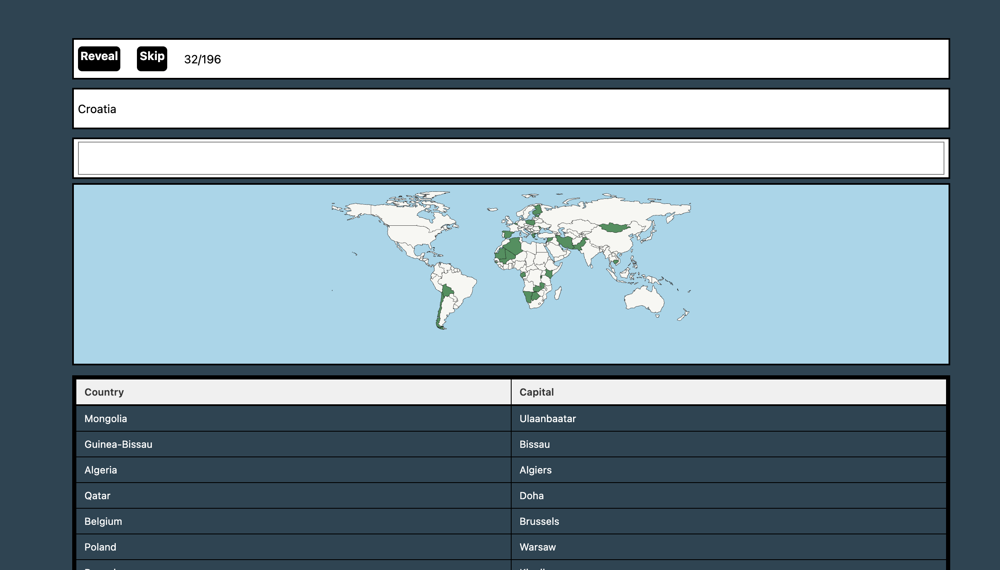
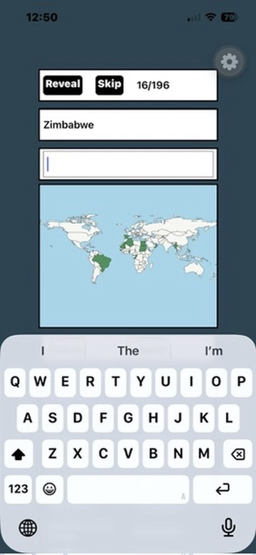

This is a quiz to name all of the capital cities of the world.

Frontend is React Native in Typescript built with Expo.

Backend is Python FastAPI with a SQLite3 database storing country data and spelling variations.

---

Modify the `API_URL` in `App.tsx` with your local IP.

`npm dev` to run -- concurrently starts API with uvicorn and Expo app with npx.

---

Based on the original [PyQt version.](https://github.com/jfeinbaum/PyQtWorldCapitalsQuiz)

